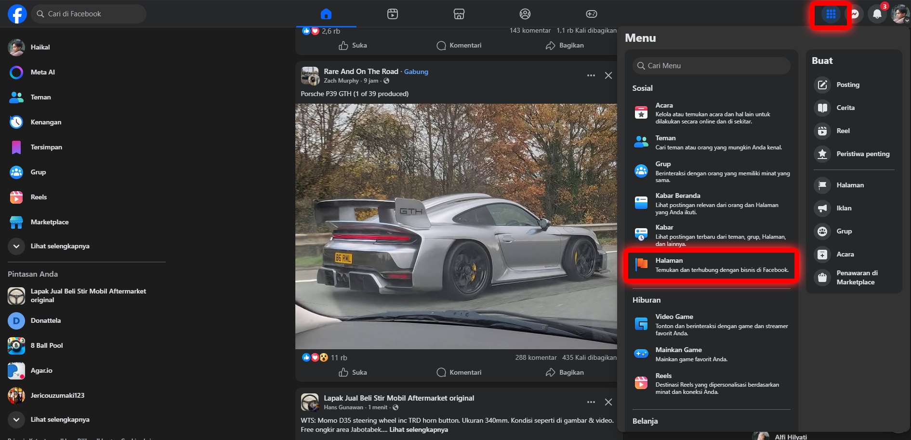
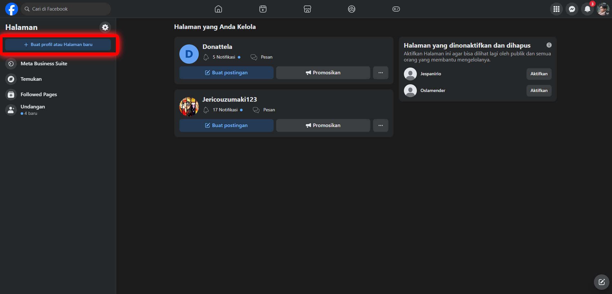
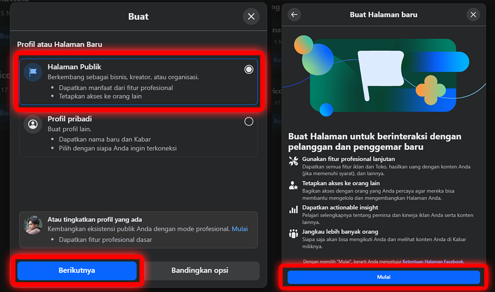
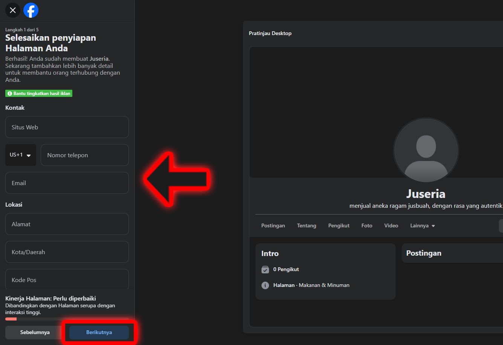
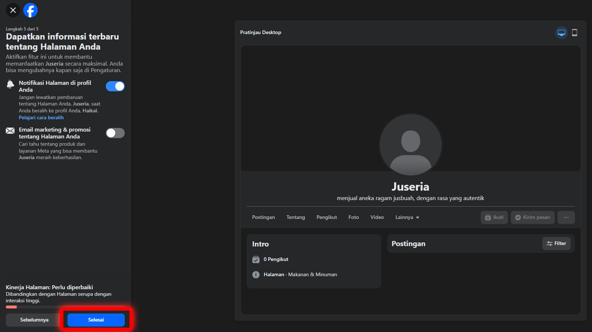
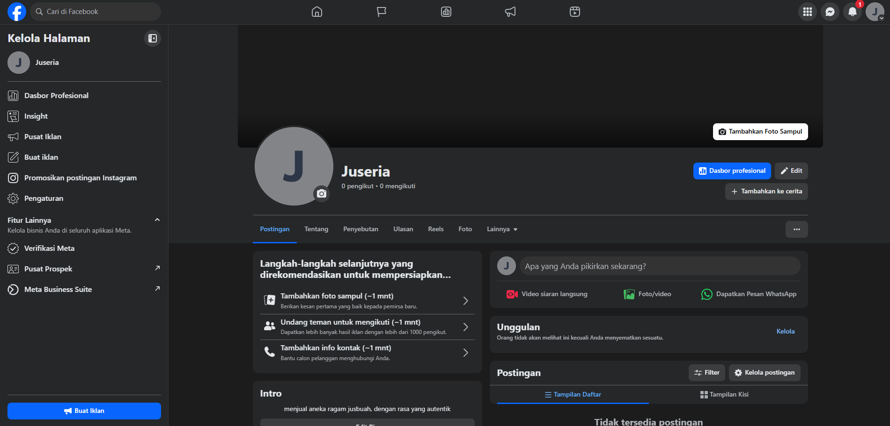

# Facebook Page

Berikut Tutorial lengkap untuk membuat akun Facebook Page

## Pilih menu Halaman

**Login** menggunakan akun facebook anda, kemudian :

- Klik tombol **Menu** yang ada di sebelah kanan atas
- Klik **Halaman** yang ada di bawah Sosial

## Buat Halaman Baru

Klik tombol **Buat profil atau Halaman baru** di sebelah kiri atas

Pilih **Halaman Publik** kemudian :
- Klik berikutnya
- Klik mulai

## Lengkapi data halaman anda

Isi nama, kategori, dan bio halaman anda, kemudian klik **Buat halaman**

Lanjut lengkapi data halaman anda atau dapat anda lewati dengan klik **berikutnya**

Klik **Selesai** dan halaman anda sudah jadi

## Halaman telah dibuat

Halaman anda akan terlihat seperti berikut

