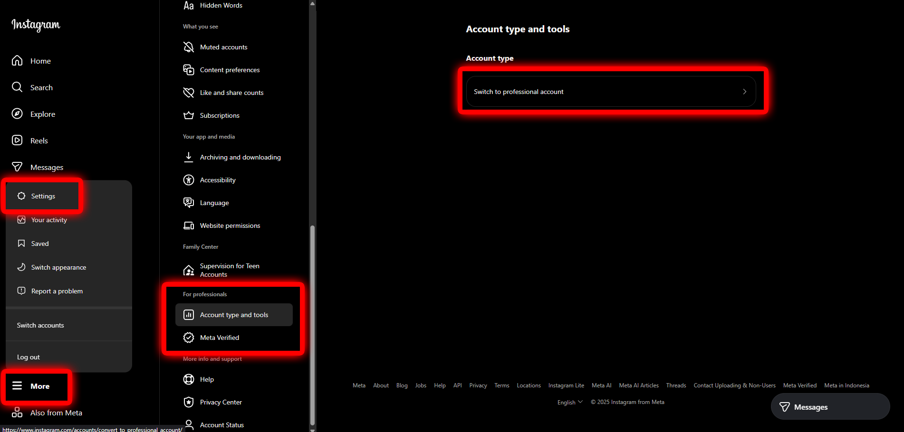
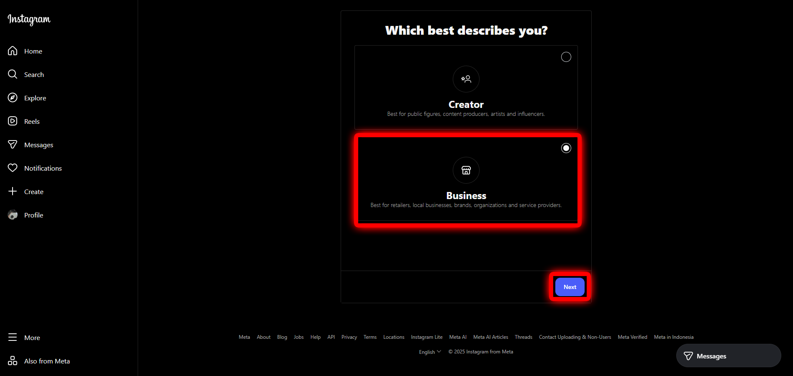
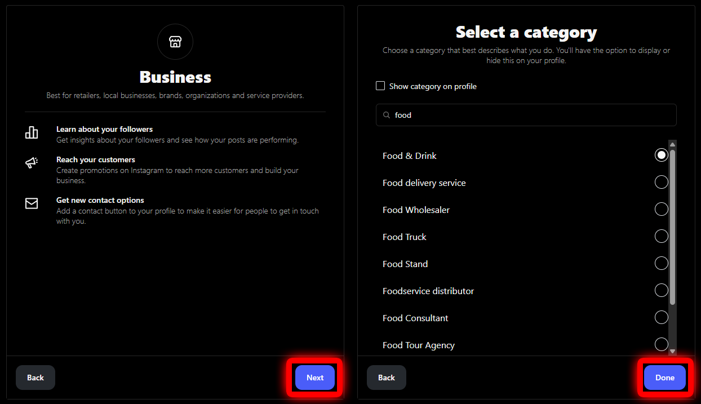
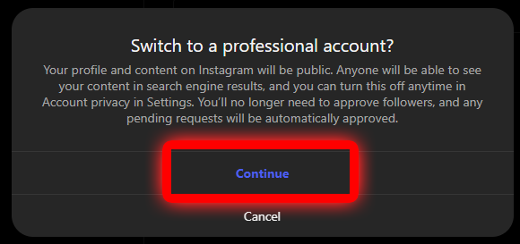
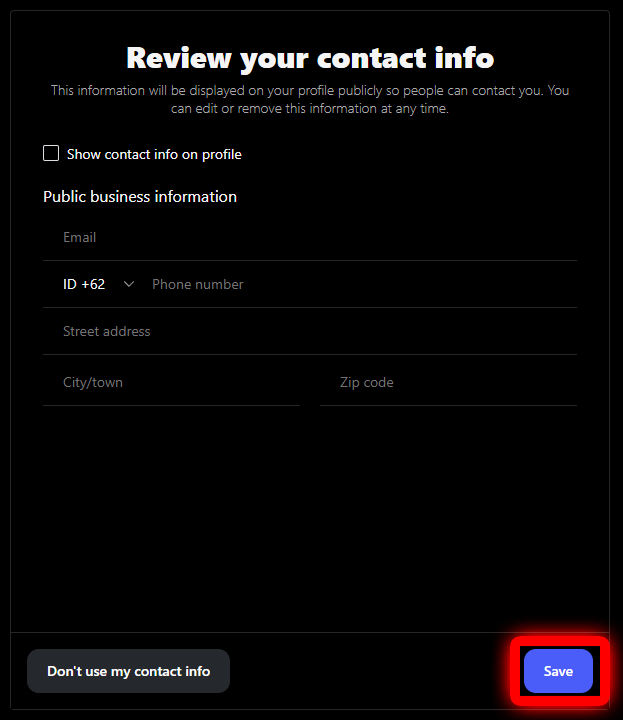

# Instagram Business

Berikut Tutorial lengkap untuk membuat akun Instagram Business

## Pilih menu Professional

**Buat** akun instagram seperti biasanya, kemudian :

- Klik tombol **Menu** (garis tiga)
- Pilih **Settings**
- Di bawah opsi **For Professional** pilih **Account type and tools**
- Klik **Switch to professional account**

## Pilih opsi Business

Pilih **Business** kemudian :

- Klik **Next**
- Cari kategori yang sesuai bisnis anda
- Klik **Done**

Kemudian klik **Continue** untuk beralih ke akun professional

## Lengkapi data halaman anda

Anda dapat melengkapi form berikut, atau dapat anda lewati dan klik **Save**

## Halaman telah dibuat

Selamat, Akun Instagram anda sudah beralih menjadi akun Instagram Business yang ditandai dengan:
- Adanya tulisan **Professional Dashboard** di halaman profil anda di aplikasi smarthpone
- Adanya opsi **Business Tools and controls**

:::caution Catatan penting!

Akun Instagram Business anda harus tersambung ke Facebook Page agar bisa terhubung ke Postmatic. 

Klik **Berikut** di bawah ini untuk tutorial lengkapnya

:::

